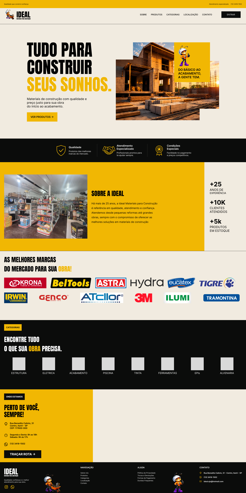

# 🏗️ Ideal Materiais Itariri

Landing page profissional desenvolvida para a **Ideal Materiais Itariri**, uma loja de materiais para construção localizada em **Itariri — SP**.

O projeto foi criado com foco em um design **moderno, responsivo e intuitivo**, utilizando animações para proporcionar uma experiência mais dinâmica aos visitantes.

---

## ✨ Preview

> _Preview da landing page da Ideal Materiais Itariri._

---

## 🚀 Tecnologias

- ⚛️ **React**
- 🔷 **TypeScript**
- 🎨 **Tailwind CSS**
- 🎬 **Framer Motion**
- ⚡ **Vite**

---

## 💡 Sobre o projeto

A landing page foi desenvolvida para apresentar a **Ideal Materiais Itariri** de forma moderna e profissional, destacando a empresa, seus produtos, categorias, marcas e localização.

O projeto conta com:

- 📱 Design responsivo
- 🎨 Identidade visual baseada em amarelo, preto e branco
- 🎬 Animações e transições com Framer Motion
- 📊 Contadores animados
- 🏷️ Marquee de marcas
- 📍 Seção de localização
- 🧱 Apresentação de categorias de produtos
- ⚡ Interface rápida e moderna

---

## 🏗️ Ideal Materiais Itariri

**Materiais para construção com qualidade e confiança.**

📍 Itariri — São Paulo, Brasil

---

**Desenvolvido com ❤️ utilizando React, TypeScript e Tailwind CSS.**

